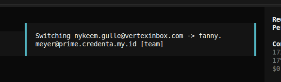
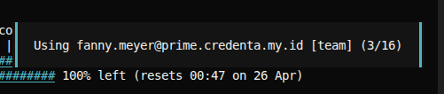
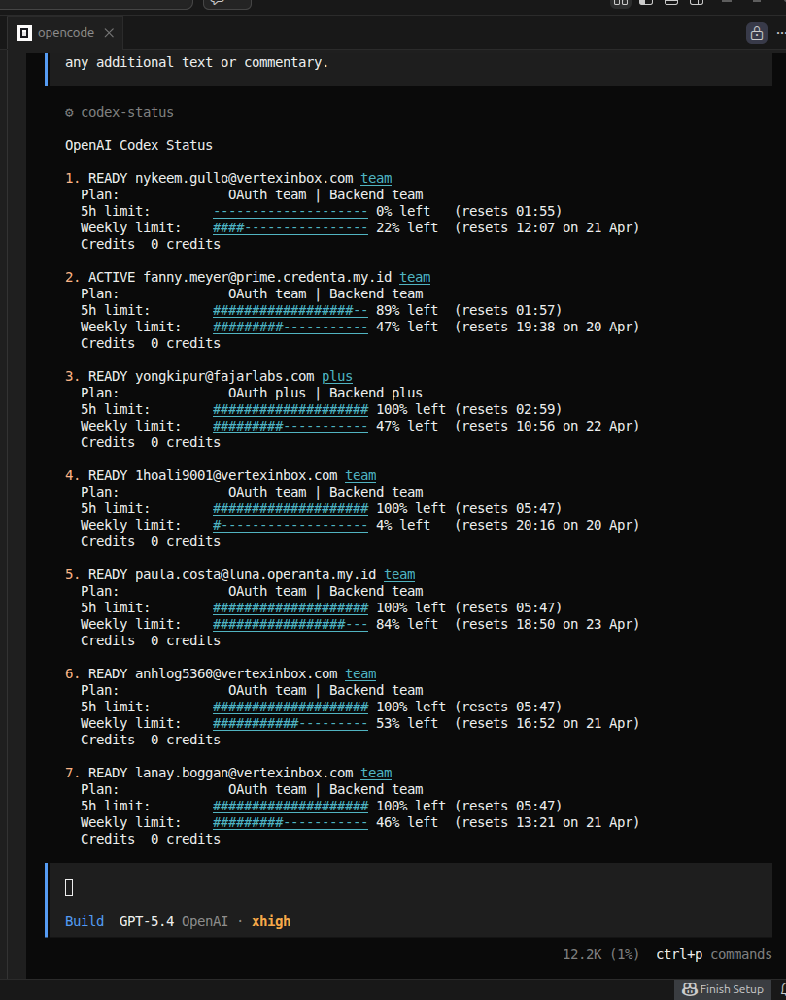

# OpenCode Shareable Setup: Rotate by Reset

Bahasa: [English](./README.md) | [Indonesia](./README.id.md)

Repository ini adalah setup OpenCode + ChatGPT OAuth multi-account yang **aman untuk dibagikan**.

Tujuan utamanya:

- portable, tanpa ketergantungan hardcoded ke `/opt/fajarlabs/AI`
- aman dipush ke GitHub
- default diarahkan ke pola **rotate akun by reset**
- tetap nyaman dipakai untuk workflow coding harian dengan OpenCode

## Dukungan OS

- Linux: didukung
- macOS: didukung
- Windows: didukung lewat wrapper PowerShell dan Command Prompt

Catatan:

- Linux dan macOS adalah alur utama yang ditampilkan sebagai default
- Linux dan macOS memakai `bin/opencode` dan `bin/bootstrap`
- Pengguna Windows PowerShell bisa memakai `bin/opencode.ps1`, `bin/opencode-personal.ps1`, dan `bin/bootstrap.ps1`
- Pengguna Windows Command Prompt bisa memakai `bin/opencode.cmd`, `bin/opencode-personal.cmd`, dan `bin/bootstrap.cmd`
- Setup PATH terminal VS Code sudah disiapkan untuk Linux, macOS, dan Windows

## Yang Perlu Di-install Dulu

Wajib:

- Node.js dan npm
- browser desktop untuk login ChatGPT OAuth

Opsional tapi disarankan:

- Git, kalau Anda ingin clone atau push repository ini
- VS Code, kalau Anda ingin workflow terminal yang sama seperti di screenshot

Tidak perlu di-install sebelumnya:

- Anda **tidak perlu** install `opencode` global terlebih dahulu
- Anda **tidak perlu** install plugin multi-auth secara manual terlebih dahulu

Alasannya:

- `./bin/bootstrap` akan memasang OpenCode CLI lokal ke `.local/`
- `./bin/bootstrap` juga akan memasang `opencode-openai-multi-auth` ke direktori config lokal milik repo ini

## Instalasi Plugin

Setup ini memakai dependency plugin berikut:

- `opencode-openai-multi-auth@5.0.6`
- `@opencode-ai/plugin@1.4.7`

Lokasi deklarasinya:

- `./.personal/home/.config/opencode/package.json`

Lokasi hasil instalasinya setelah bootstrap:

- `./.personal/home/.config/opencode/node_modules/`

Untuk memasang CLI lokal dan plugin sekaligus:

Linux dan macOS:

```bash
./bin/bootstrap
```

Windows PowerShell:

```powershell
./bin/bootstrap.ps1
```

Windows Command Prompt:

```bat
.\bin\bootstrap.cmd
```

Kalau Anda hanya ingin memasang dependency plugin saja:

Linux dan macOS:

```bash
npm install --prefix ./.personal/home/.config/opencode
```

Windows PowerShell:

```powershell
npm install --prefix ./.personal/home/.config/opencode
```

Windows Command Prompt:

```bat
npm install --prefix .\.personal\home\.config\opencode
```

Plugin ini dimuat lewat `./.personal/home/.config/opencode/opencode.json` pada bagian `plugin`.

## Cara Kerja Rotasi

Setup ini mengaktifkan default berikut:

- `OPENCODE_OPENAI_STRATEGY=sticky`
- `OPENCODE_OPENAI_SESSION_REEVAL_MS=0`
- `OPENCODE_OPENAI_USAGE_REFRESH_MS=30000`

Secara praktik, artinya:

- binding session ke akun dievaluasi ulang pada setiap request
- snapshot usage direfresh setiap 30 detik
- plugin bisa memprioritaskan akun dengan **reset terdekat** saat memilih ulang akun
- ketika satu akun kena limit, akun lain yang masih tersedia bisa dipakai

Pola ini lebih cocok untuk workflow "pakai akun yang paling cepat pulih" dibanding rotasi murni per request.

## Isi Repo Ini

- `HOME` OpenCode yang terisolasi di dalam repository
- struktur yang aman untuk GitHub agar token akun tidak ikut ter-commit
- script bootstrap lokal untuk instalasi dependency
- wrapper Unix untuk Linux dan macOS
- wrapper PowerShell dan Command Prompt untuk Windows
- config OpenCode siap pakai dengan preset OAuth GPT-5 family
- default yang diarahkan ke pola reuse akun berbasis reset
- dokumentasi dua bahasa untuk dibagikan ke tim atau klien

## Ringkasan Fitur

- workflow ChatGPT OAuth multi-account melalui `opencode-openai-multi-auth`
- perilaku rotasi yang dioptimalkan ke akun dengan reset terdekat
- isolasi config lokal agar tidak mengganggu config utama mesin Anda
- `.gitignore` aman untuk file akun, session binding, cache, dan `node_modules`
- OpenCode CLI dipasang lokal melalui dependency project
- integrasi PATH terminal VS Code
- entrypoint lintas OS untuk Linux, macOS, Windows PowerShell, dan Windows CMD
- mudah dioverride lewat environment variable saat runtime

## Struktur Folder

```text
opencode-share-reset-rotate/
├── README.md
├── README.id.md
├── .gitignore
├── bin/
│   ├── bootstrap.cmd
│   ├── bootstrap
│   ├── bootstrap.ps1
│   ├── opencode.cmd
│   ├── opencode
│   ├── opencode-personal.cmd
│   ├── opencode-personal
│   ├── opencode-personal.ps1
│   └── opencode.ps1
├── .vscode/
│   └── settings.json
├── .local/
│   └── package.json
├── .personal/
│   └── home/
│       └── .config/
│           └── opencode/
│               ├── .gitignore
│               ├── AGENTS.md
│               ├── opencode.json
│               └── package.json
└── docs/
    ├── screenshots/
    │   ├── account-in-use.png
    │   ├── account-list.png
    │   └── account-switcher.png
    ├── setup.md
    └── setup.id.md
```

## Screenshot

### Toast Perpindahan Akun

Menampilkan notifikasi saat akun aktif berpindah.



### Akun yang Sedang Dipakai

Menampilkan akun yang sedang aktif di sesi OpenCode.



### Daftar Akun dan Status Codex

Menampilkan daftar akun beserta readiness, plan, dan informasi reset.



## Quick Start per OS

### Linux dan macOS

Kalau ini pertama kali: install Node.js + npm dulu. Anda tidak perlu install `opencode` global.

1. Masuk ke folder ini.
2. Install dependency lokal:

```bash
./bin/bootstrap
```

3. Login akun pertama:

```bash
./bin/opencode-personal auth login
```

Pilih `ChatGPT Plus/Pro (Codex Subscription)`.

4. Tambah akun berikutnya:

```bash
./bin/opencode-personal auth login
```

Pilih `Add Another OpenAI Account`.

5. Jalankan tes cepat:

```bash
./bin/opencode-personal run "write hello world to test.txt" --model=openai/gpt-5.2 --variant=medium
```

### Windows PowerShell

Kalau ini pertama kali: install Node.js + npm dulu. Anda tidak perlu install `opencode` global.

```powershell
./bin/bootstrap.ps1
./bin/opencode-personal.ps1 auth login
./bin/opencode-personal.ps1 run "write hello world to test.txt" --model=openai/gpt-5.2 --variant=medium
```

### Windows Command Prompt

Kalau ini pertama kali: install Node.js + npm dulu. Anda tidak perlu install `opencode` global.

```bat
.\bin\bootstrap.cmd
.\bin\opencode-personal.cmd auth login
.\bin\opencode-personal.cmd run "write hello world to test.txt" --model=openai/gpt-5.2 --variant=medium
```

## Contoh Pemakaian Harian

Linux dan macOS:

```bash
./bin/opencode-personal run "summarize this repository" --model=openai/gpt-5.2 --variant=medium
./bin/opencode-personal run "fix the failing test" --model=openai/gpt-5.2-codex --variant=high
OPENCODE_OPENAI_STRATEGY=hybrid ./bin/opencode-personal run "refactor this module"
```

Windows PowerShell:

```powershell
./bin/opencode-personal.ps1 run "summarize this repository" --model=openai/gpt-5.2 --variant=medium
./bin/opencode-personal.ps1 run "fix the failing test" --model=openai/gpt-5.2-codex --variant=high
$env:OPENCODE_OPENAI_STRATEGY='hybrid'; ./bin/opencode-personal.ps1 run "refactor this module"
```

Windows Command Prompt:

```bat
.\bin\opencode-personal.cmd run "summarize this repository" --model=openai/gpt-5.2 --variant=medium
.\bin\opencode-personal.cmd run "fix the failing test" --model=openai/gpt-5.2-codex --variant=high
set OPENCODE_OPENAI_STRATEGY=hybrid && .\bin\opencode-personal.cmd run "refactor this module"
```

## Default Runtime

Nilai berikut otomatis dipasang oleh wrapper kecuali Anda override sendiri:

- `OPENCODE_OPENAI_STRATEGY=sticky`
- `OPENCODE_OPENAI_SESSION_REEVAL_MS=0`
- `OPENCODE_OPENAI_USAGE_REFRESH_MS=30000`
- `OPENCODE_CONFIG=<repo>/.personal/home/.config/opencode/opencode.json`

## Yang Tidak Disertakan Repo Ini

- token akun aktif
- export session binding aktif
- source code plugin upstream atau `node_modules`
- pembuatan remote GitHub otomatis
- account manager custom; repo ini tetap bergantung pada plugin upstream

## VS Code

Jika folder ini dibuka di VS Code, terminal terintegrasi otomatis menambahkan `./bin` ke `PATH`, jadi Anda bisa menjalankan:

```bash
opencode
```

## File yang Sengaja Tidak Dibagikan

Repository ini sengaja mengabaikan:

- `openai-accounts.json`
- `openai-multi-auth-session-bindings.json`
- cache OpenCode
- cache npm
- `node_modules`

Dengan begitu repo tetap aman dipublish, selama `.gitignore` tidak diubah.

## Catatan Penting

- Setup ini memakai `opencode-openai-multi-auth@5.0.6`
- OpenCode CLI lokal dipasang melalui `.local/package.json`
- Jika ingin memakai binary lain, set `OPENCODE_BIN=/path/to/opencode`
- Logika rotasi akun yang sebenarnya disediakan oleh plugin upstream, sedangkan repo ini membungkusnya menjadi layout portable yang lebih aman untuk dibagikan

Lihat [docs/setup.id.md](./docs/setup.id.md) untuk panduan lengkap.

## Credit

- Dibagikan oleh [Fajar Budi Setiawan](https://fajarlabs.com)
- Repository ini membungkus dan mendokumentasikan setup shareable di atas OpenCode serta workflow [`opencode-openai-multi-auth`](https://github.com/dkraemerwork/opencode-openai-multi-auth) yang berlisensi MIT.
